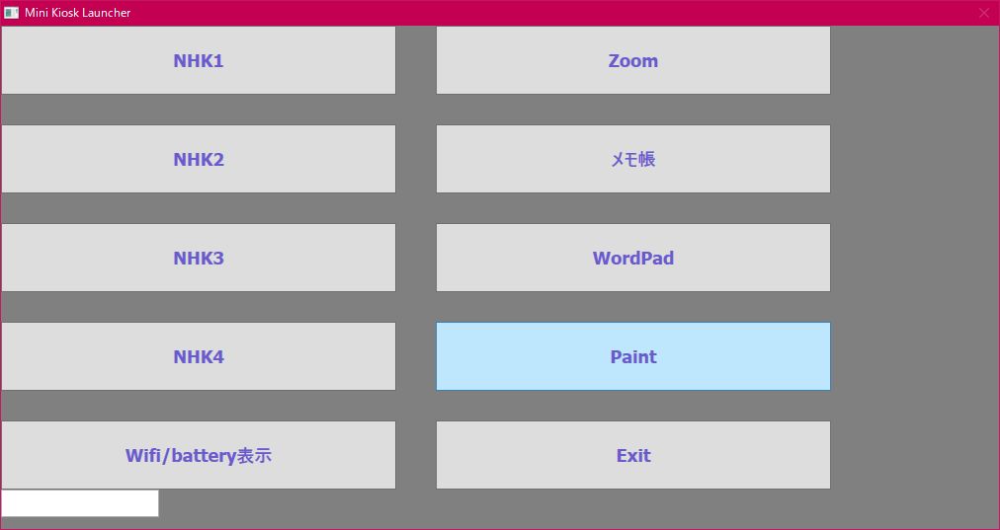
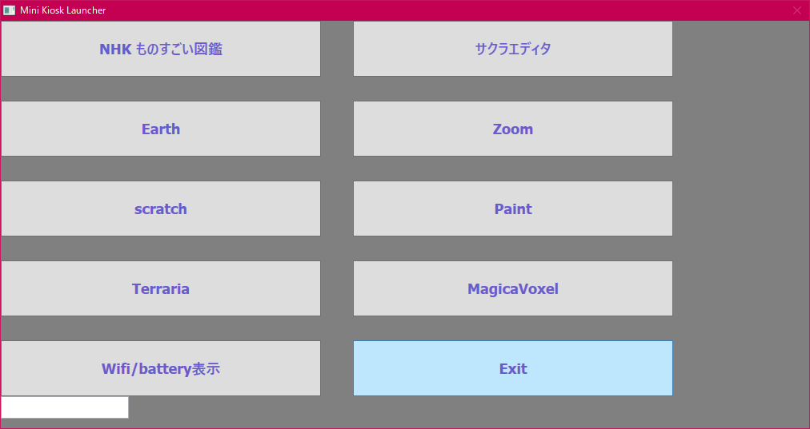

そうだ余っているWinTabをキオスク端末にしてみよう
------------------------------------------------

****************
 
****************


* 動機
強力なペアレントコントロールの効かせたYoutube禁止で、Zoom用の
端末を用意しようとすると、WindowsProが必要になります。
そのために、ライセンスを購入するのはためらわれます。じゃあ余っている
WinTab（ATOM）をカスタマイズして、キオスク端末にしちゃえばいいじゃないか。
こうして、タブレット起動後には簡単なランチャーを起動するだけにする形で
実現されました。
Zoomと、教育のコンテンツくらいしか見えないようにすることに成功しました。

* インストール方法
  - 管理者権限のない一般ユーザを作成する。ここで説明のためkioskという名前でつくる
  - 必要なアプリをインストールする。ここでは、Zoomをインストールしておく
  - C:\kioskにこちらのランチャーを展開する
  - C:\kiosk\kiosk.regを登録する
    kioskユーザで起動した際に、Explorereではなく、こちらのランチャーを起動するようにする。
    - kiosk.exeでもよいのですが、色々カスタマイズしやすくするためにkiosk.batにします
```
Windows Registry Editor Version 5.00

[HKEY_CURRENT_USER\SOFTWARE\Microsoft\Windows\CurrentVersion\Policies\System]
"Shell"="c:\\kiosk\\kiosk.bat"
```
  
kiosk.batではスクリーンキーボードを起動してから、ランチャーを起動するようにしています。NotePCではスクリーンキーボードはコメントアウトしてよいと思います。

* カスタマイズ１ 
  - 管理者のパスワードを変更する
    kiosk.batの`c:\kiosk\kiosk.exe password 2`の第二引数 passwordを任意の文字に変更します。ランチャーの左下のテキストボックスに入力すると、通常のWindowsに切り替わります。

* カスタマイズ2
  - 起動したアプリを終了した場合に、ランチャーに戻るようになっています。
    ランチャーに戻らずに、ランチャーも終了して、ログアウトするには
    kiosk.batの`c:\kiosk\kiosk.exe password 2`の第三引数を削除します。
    例 `c:\kiosk\kiosk.exe password `

* カスタマイズ3
  メニューの内容を変更する
  kiosk.settingファイルを編集します。3行ごとに定義するものとなっています。
  1行目 アプリ①のタイトル
  2行目 アプリ①のフルパス
  3行名 アプリ①の引数(ない場合は空行にしてください)
  4行目 アプリ②のタイトル
  5行目 アプリ②のフルパス
  6行名 アプリ②の引数(ない場合は空行にしてください)
      ：
      ：

* 使い方のヒント１
  Exitで終了後に、画面の後ろ側のコマンドプロンプトが5秒経過すると終了します。
  5秒以内に画面をクリックすると、終了処理が停止します。ここで、前面のコマンドプロンプトで操作ができます。

* 使い方のヒント２
  このランチャーから起動できるのはWin32/64アプリになります。UWPは起動させることができませんでした。

* 使い方のヒント3
  ブラウザをkioskモードで起動させると、終了させる方法がないので、電源ボタンからのシャットダウンへの移行を使ってください。

* 使い方のヒント4
  バッテリーとWifiが確認できないと辛いようなので、起動時と左下のボタンから
  表示されるようにしました。

* うちの場合の特別メニューはこちらです。

****************
 
****************

* その他
  もし、これがそれなりに需要があれば、インストーラとかも作ってみようと思います。
